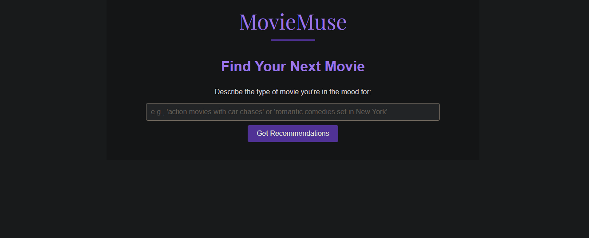

# MovieMuse
## Your AI Movie Connoisseur

Can't figure out what to watch for Movie Night? We got you!

Just enter the general vibes you're looking for and MovieMuse will provide you with a handful of movies tailored to your needs.



## Setup
### Create and activate Virtual Environment
Create a virtual environment using the following command
```
python -m venv env
```
Activate the virtual environment using the following command
```
env/Scripts/activate.bat //in CMD
env/Scripts/activate.ps1 //in Powershell
source env/Scripts/activate //in Unix
```
### Install required dependencies
Install the dependencies using
```
pip install -r requirements.txt
```

In addition to those, you'll need two API Keys. One for [TMDB](https://developer.themoviedb.org/docs/getting-started) and one for [OpenAI](https://openai.com/index/openai-api/)

## Starting the application
After setting up the environment and installing the dependencies the app can be run using
```
python app.py
```
